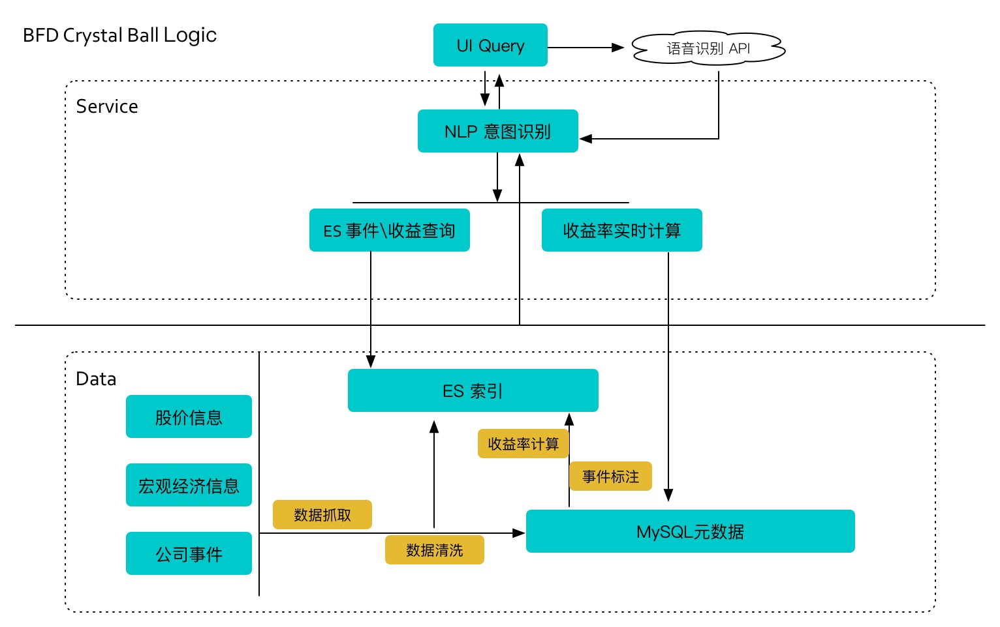

# BFD Crystal Ball

### 1.【Overview】
		
		1. Data based decision assistant 
		2. Speedy calculation of events impact
		3. Natual Language interface

		Slogan: Simple \ Fast \ Effective 

---

**[BFD Crystal Ball](http://bfdcrystal.com)** (`Crystal`) is a revolutionary intelligent platform that compute  the historical return on financial Events, assisting the investors making wise decisions in a fast way.
Financial Events take a big part in financial market.

When a company release it's annual report , it's company stock price will fluctuate accordingly. 

When the government signals a interest rate drop, the stock price will react accordingly.

Capturing the the impact as quick as possible is the key to making money in financial system, so 
we proposing a fast way to calculate the impact of one event once it occurs, base on historical data.

#### What Crystal support?

1. Macro Events
	* 	Interest rate drop
	*  Interest rate rise
	*  Reserve deposit ratio drop
	*  reserve deposit ratio rise

2. PV Events
	*	Stock price rising 7%
	*	Stock price keep droping 5 days
	*  Turnover rate exceeds 
    
3.	Company Events
	*	Divident annouced
	* 	Officials Holding
    
### 2.【Architecture】
	
	High Availability 
	
	
	
	
	### 3.【Modules】

### 4.【Have a try!!!】

