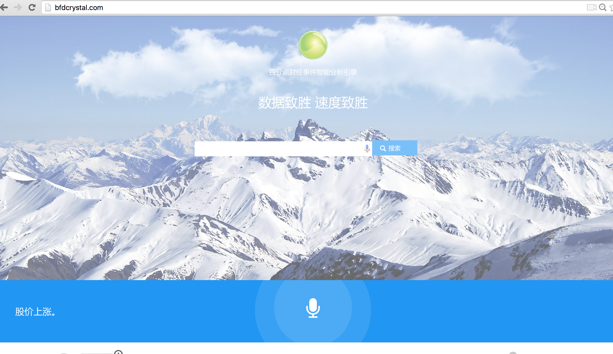

# BFD Crystal Ball

> **Team members:**
>> [Frank Huang](http://www.github.com/iceageFrank): wei.huang@baifendian.com 

>> [EricLiutyy](http://www.github.com/EricLiutyy): eric.liu@baifendian.com


### 1. What BFD Crystal Ball is ?		
---

**[BFD Crystal Ball](http://bfdcrystal.com)** (`Crystal`) is a revolutionary intelligent platform that compute  the historical return on financial Events, assisting the investors on making wise decisions in fast way. 

Financial Events take a big part in financial market. 

- When a company release it's annual report , it's company stock price will fluctuate accordingly. 

- When the government signals a interest rate drop, the stock price will react accordingly.



Capturing the the impact as quick as possible is the key to making money in financial system, so we proposing a fast way to calculate the impact of one event once it occurs, base on historical data.


**Slogan:  Simple \ Fast \ Effective**

	1. Data based decision assistant 
	2. Speedy calculation of events impact
	3. Natual Language interface

		 


### 2. What Crystal support?

1. Macro Events
	
	*  Interest rate drop
	*  Interest rate rise
	*  Reserve deposit ratio drop
	*  reserve deposit ratio rise


2. PV Events
	*	Stock price rising 7%
	*	Stock price keep droping 5 days
	*  Turnover rate exceeds 

    
3.	Company Events
	*	Divident annouced
	* 	Officials Holding

    
### 3. How Crystal works?

As a real-time financial event analysis system, it should be simple to use, fast to response, and effective for result, so we consider those in two parts:
	
> #### Architecture
	
* **Optimized business logic:**
		 
	
	
	> **Human voice input (智能语音输入)**
	
	By calling xunfei voice input service, we provide real-time voice input for stock event online searching.
	
	> **NLP intention recognition (NLP 意图识别)**
		
	This part serves as a translator from natural language to structured query input which could be used to search database. Based on financial knowledge, we define several important aspects of an event to be extracted, including event name, event entity, date, impact entity and so on. To extract those aspects from natural language, both semantic and syntactic rules are utilised. Meanwhile, the prior knowledge of finance is also appropriately considered in extraction process so that the translation of user's enqueries could be relatively more accurate.
	For instance, when a user asks "How is the index of banks going after the central bank reduce interest during last year?", this translator would give a structured output like:

		`{event name:reduction of interest, event entity:central bank, date:last year, impact entity:bank index}`
		
	> **ES Event && Yield Query(后市收益查询)**
	
	> **ES Event && Yield Query(收益实时查询)**
	
	> **Unstructured Stock Data event collection(非结构化数据抓取)**

	> **Stock Event Procesing(股票事件处理、标注)**

*	**Layers in technique level:**
	
	**Principle:**
	
			- High Concurrency (高并发)
			- High Availability (高可用)
			- Low coupling (低耦合)
			- Low latency（低延迟）
			- Flexible (易扩展)

   _Logic workflow:_
   
  

**1. Load Banlance (负载均衡)**

We use two layers LB.
	
First Level:  Use one Nginx as frontend gateway for user query.

Second Level: Use two nginx nodes for REST API core service

It's easy to add new service node to improve the performance without impact the online service.
	
		
**2. Java REST API**
	
We expose all backend service as standard REST Api with token validation.
	
> We use [spring boot](http://projects.spring.io/spring-boot/#) to develop java web application as Java micro-service in one single java process, which is quite simple for DevOps;
	One web application is one single process, and extremely simple for capacity expansion.
	
	
**3. Real-time calculation service (实时计算 HA)**
	
We support real-time yield rates calculation by invoking our online python rpc service.
	
We use [Baifendian HA-RPC](https://github.com/baifendian/harpc) framework to access backend python service
	
As above, we deployed several python service on two physical machine, invoke by Java service, coordinated by ZooKeeper;
	
	
**4. Data storage (索引数据存储)**
	
We use Elastic Search v1.6 as our events \ stock entities  and yield return data storage which support mass amount data millseconds query.

### 4.【Have a try!!!】

> Try to [BFD Crystal Ball](http://bfdcrystal.com)...

---
> Step 1: Open our website:

> Step 2: Click voice input button, speak out your words:

> Step 3: Click search then ... **Opps!!!**  Check out what you want:

